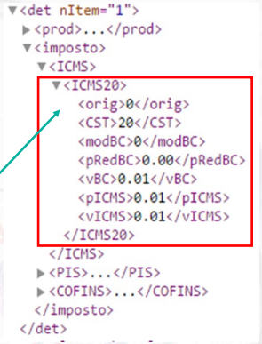
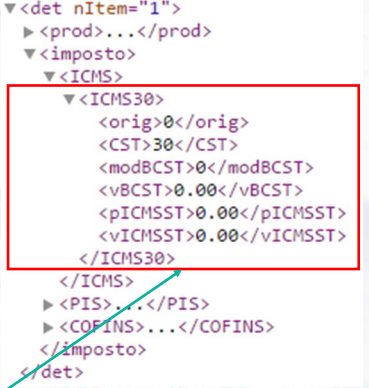
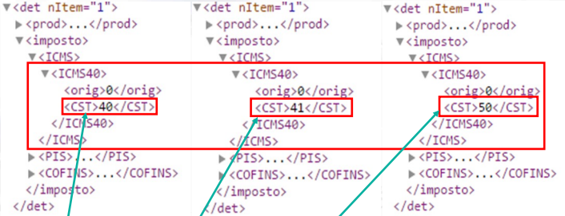
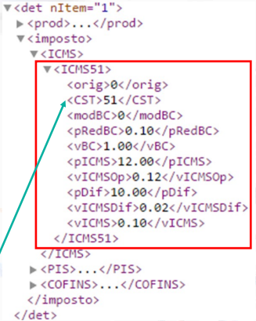

  <h1>Tributação para Programadores</h1>

Casa do Desenvolvedor | Tributacao para Programadores

> Tudo o que um programador de software precisa entender sobre tributação fiscal e documentos fiscais eletrônicos.

---

# Módulo 3 - ICMS

> [PDF Módulo 3](assets/Modulo3.pdf)

## 📌 Table of Contents

- [CST Tabela A | Origem da Mercadoria](#cst-tabela-a--origem-da-mercadoria)
  - [Observação](#observação)
- [CST Tabela B | Tributação pelo ICMS](#cst-tabela-b--tributação-pelo-icms)
- [CST `00` | Tributada Integralmente](#cst-00--tributada-integralmente)
- [CST `10` | Tributada e com Cobrança do ICMS por Substituição Tributária](#cst-10--tributada-e-com-cobrança-do-icms-por-substituição-tributária)

---

# CST Tabela A | Origem da Mercadoria

| Código | 	Descrição                                                                                                             |  % ICMS   |
|:------:|:-----------------------------------------------------------------------------------------------------------------------|:---------:|
|  `0`   | 	Nacional, exceto as indicadas nos códigos 3, 4, 5 e 8                                                                 | 7% ou 12% |
|  `1`   | 	Estrangeira - Importação Direta, exceto a indicada no código 6                                                        |    4%     |
|  `2`   | 	Estrangeira - Adquirida no Mercado Interno, exceto a indicada no código 7                                             |    4%     |
|  `3`   | 	Nacional, Mercadoria ou Bem com Conteúdo de Importação superior a 40% e infoerior ou igual a 70%                      |    4%     |
|  `4`   | 	Nacional, cuja produção tenha sido feita em conformidade com os processos produtivos de acordo com o Decr. Lei 288/67 | 7% ou 12% |
|  `5`   | 	Nacional, Mercadoria ou Bem com Conteúdo de Importação Inferior ou Igual a 40%                                        | 7% ou 12% |
|  `6`   | 	Estrangeira - Importação Direta, sem similar nacional, constante em lista de Resolução CAMEX e gás natural            | 7% ou 12% |
|  `7`   | 	Estrangeira - Adquirida no Mercado Interno, sem similar nacional, constante em lista de Resolução CAMEX e gás natural | 7% ou 12% |
|  `8`   | 	Nacional, Mercadoria ou BEm com Conteúdo de Importação Superior a 70%                                                 |    4%     |

## Observação

A redução da alíquota do ICMS para `4%` aplica-se exclusivamente às **operações interestaduais** que envolvem **produtos importados** ou produtos que contêm partes importadas.

`7%` ou `12%`
-  `7%` | Aplicado para operações interestaduais com destino às regiões Norte, Nordeste, Centro-Oeste e o estado do Espírito Santo.
-  `12%` | Aplicado para operações interestaduais com destino às demais regiões (Sul e Sudeste, exceto Espírito Santo).

(<a href="#top-readme">back to top</a>)

# CST Tabela B | Tributação pelo ICMS

| Código | Descrição                                                                     |
|:------:|:------------------------------------------------------------------------------|
|   00   | Tributada Integralmente                                                       |
|   10   | Tributada e com cobrança do ICMS por substituição tributária                  |
|   20   | Com redução de base de cálculo                                                |
|   30   | Isenta ou não tributada e com cobrança do ICMS por substituição tributária    |
|   40   | Isenta                                                                        |
|   41   | Não tributada                                                                 |
|   50   | Suspensão                                                                     |
|   51   | Diferimento                                                                   |
|   60   | ICMS cobrado anteriormente por substituição tributária                        |
|   70   | Com redução da base de cálculo e cobrança do ICMS por substituição tributária |
|   90   | Outras                                                                        |

(<a href="#top-readme">back to top</a>)

# CST `00` | Tributada Integralmente

Uma operação **interna** ou **interestadual** cujo icms incide sobre a alíquota cheia.

|    TAG    | DEFINIÇÃO                                                                                                                                                                  |
|:---------:|:---------------------------------------------------------------------------------------------------------------------------------------------------------------------------|
| `<orig>`  | **Origem da Mercadoria** ([Tabela A](#cst-tabela-a--origem-da-mercadoria))                                                                                                 |
|  `<CST>`  | **Código de Situação Tributária** ([Tabela B](#cst-tabela-b--tributação-pelo-icms))                                                                                        |
| `<modBC>` | **Modalidade da Base de Cálculo** <ul><li>`0` - Margem Valor Agregado</li><li>`1` - Pauta</li><li>`2` - Preço Tabelado Máximo</li><li>`3` - Valor da Operação</li></ul> |
|  `<vBC>`  | **Valor da Base de Cálculo** <ul><li>Valor da Base de Cálculo do ICMS</li></ul>                                                                                         |
| `<pICMS>` | **Alíquota do ICMS** <li>Percentual do Imposto (ICMS)</li></ul>                                                                                                         |
| `<vICMS>` | **Valor do ICMS** <ul><li>Imposto (valor do ICMS)</li></ul>                                                                                                             |

(<a href="#top-readme">back to top</a>)

# CST `10` | Tributada e com Cobrança do ICMS por Substituição Tributária

Além do ICMS próprio. Ele também tem uma tributação sobre a operação de **Substituição Tributária**.

|     TAG     | DEFINIÇÃO                                                                                                                                                                                                                                                                                                                                                                                                                                                                                                                                                            |
|:-----------:|:---------------------------------------------------------------------------------------------------------------------------------------------------------------------------------------------------------------------------------------------------------------------------------------------------------------------------------------------------------------------------------------------------------------------------------------------------------------------------------------------------------------------------------------------------------------------|
|  `<orig>`   | **Origem da Mercadoria** ([Tabela A](#cst-tabela-a--origem-da-mercadoria))                                                                                                                                                                                                                                                                                                                                                                                                                                                                                           |
|   `<CST>`   | **Código de Situação Tributária** ([Tabela B](#cst-tabela-b--tributação-pelo-icms))                                                                                                                                                                                                                                                                                                                                                                                                                                                                                  |
|  `<modBC>`  | **Modalidade da Base de Cálculo** <ul><li>`0` - Margem Valor Agregado</li><li>`1` - Pauta</li><li>`2` - Preço Tabelado Máximo</li><li>`3` - Valor da Operação</li></ul>                                                                                                                                                                                                                                                                                                                                                                                           |
|   `<vBC>`   | **Valor da Base de Cálculo** <ul><li>Valor da Base de Cálculo do ICMS</li></ul>                                                                                                                                                                                                                                                                                                                                                                                                                                                                                   |
|  `<pICMS>`  | **Alíquota do ICMS** <ul><li>Percentual do Imposto (ICMS)</li></ul>                                                                                                                                                                                                                                                                                                                                                                                                                                                                                               |
|  `<vICMS>`  | **Valor do ICMS** <ul><li>Imposto (valor do ICMS)</li></ul>                                                                                                                                                                                                                                                                                                                                                                                                                                                                                                       |
| `<modBCST>` | **Modalidade da Base de Cálculo do ICMS Substituição Tributária** <ul><li>`0` - Preço Tabelado ou Máximo Sugerido</li><li>`1` - Lista Negativa (valor)</li><li>`2` - Lista Positiva (valor)</li><li>`3` - Lista Neutra (valor)</li><li>`4` - Margem Valor Agregado (%) <ul><li>Fundamental para calcular o valor da Substituição Tributária</li><li>Percentual definido com base em convênios e/ou protocolos definidos entre os dois estados (origem e destino) da mercadoria</li></ul></li><li>`5` - Pauta (valor)</li><li>`6` - Valor da Operação</li></ul> |
|  `<vBCST>`  | **Valor da Base de Cálculo do ICMS Substituição Tributária** <ul><li>Valor definido pela Margem de Valor Agregado <ul><li>vBC * Margem de Valor Agregado</li></ul></li></ul>                                                                                                                                                                                                                                                                                                                                                                                   |
| `<pICMSST>` | **Alíquota do Imposto do ICMS Substituição Tributária** <ul><li>Alíquota do ICMS Substituição Tributária</li></ul>                                                                                                                                                                                                                                                                                                                                                                                                                                                |
| `<vICMSST>` | **Valor do ICMS Substituição Tributária** <ul><li>Valor do ICMS Substituição Tributária **retido**</li><li>Valor calculado por: <ul><li>(vBCST * pICMSST) - vICMS</li></ul></li></ul>                                                                                                                                                                                                                                                                                                                                                                          |

(<a href="#top-readme">back to top</a>)

# CST `20` | Com Redução de Base de Cálculo

Além de ter o ICMS próprio, tem o benefício fiscal que é a **Redução da Base de Cálculo**.

Valor do pICMS e vICMS já estão contemplando a redução da base de cálculo.

(<a href="#top-readme">back to top</a>)

# CST `30` | Isenta ou Não Tributada e com Cobrança do ICMS por Substituição Tributária

Alteração cujo ICMS próprio tem uma isenção ou não tributação, porém há uma tributação em relação à subtituição tributária.

O imposto própripo não será recolhido (benefício fiscal concedido), mas o cálculo da substituição tributária será aplicado conforme o CST 10 (tributado pela substituição tributária).

(<a href="#top-readme">back to top</a>)

# CST `40` | Isenta

Idêntico em questão de preenchimento de XML ao [CST `41`](#cst-41--não-tributada) e [CST `50`](#cst-50--suspensão). Deve colocar nas informações adicionais o amparo legal da isenção.

Foi concedido com base em alguma lei federal que concede a isenção do ICMS.

(<a href="#top-readme">back to top</a>)

# CST `41` | Não Tributada

Idêntico em questão de preenchimento de XML ao [CST `40`](#cst-40--isenta) e [CST `50`](#cst-50--suspensão). Deve colocar nas informações adicionais o amparo legal da não tributação.

Foi concedido com base em alguma lei federal ou lei estadual que concede a não tributação do ICMS.

(<a href="#top-readme">back to top</a>)

# CST `50` | Suspensão

Idêntico em questão de preenchimento de XML ao [CST `40`](#cst-40--isenta) e [CST `41`](#cst-41--não-tributada). Deve colocar nas informações adicionais o amparo legal da suspensão.

Não recolhimento do imposto de uma forma temporária. Remessa pra concerto por exemplo, ela tem um prazo e uma condição para ser suspenso naquele momento.

(<a href="#top-readme">back to top</a>)

# CST `51` | Diferimento

Diferimento é um benifício fiscal que difere a tributação para o momento seguinte. Geralmente o diferimneto ocorre dentro do próprio estado.

Exemplo: uma indústria automobilistica que tenha aquisições de matéias primas de diferentes fornecedores, o fornecedor não distaca o icms, ele será **diferido**, ele não é pago nesse momento, mas será pago no momento da saída do automóvel (valor final, cheio).

(<a href="#top-readme">back to top</a>)

# CST `60` | ICMS Cobrado Anteriormente por Substituição Tributária

(<a href="#top-readme">back to top</a>)

# CST `70` | Com Redução da Base de Cálculo e Cobrança do ICMS por Substituição Tributária

(<a href="#top-readme">back to top</a>)

# CST `90` | Outras

(<a href="#top-readme">back to top</a>)

