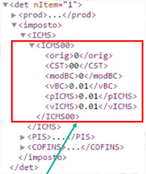
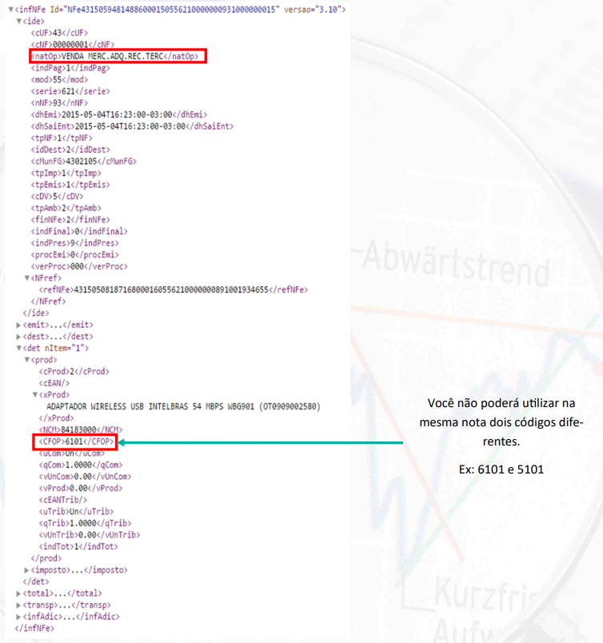
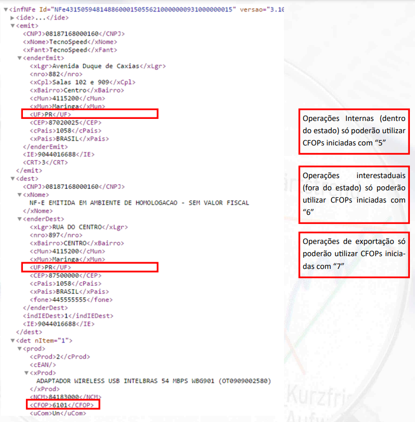
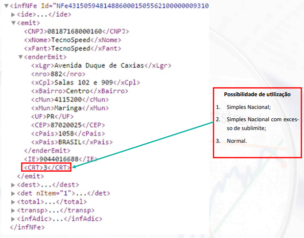
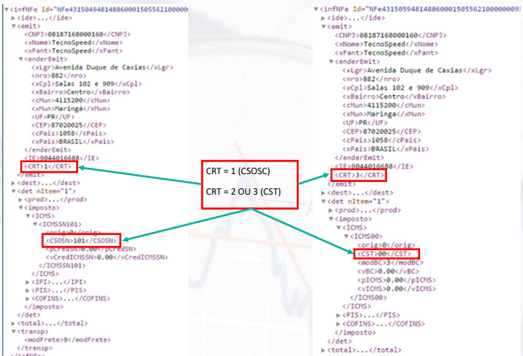
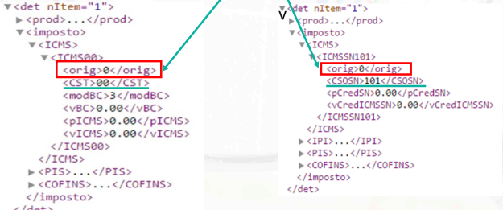
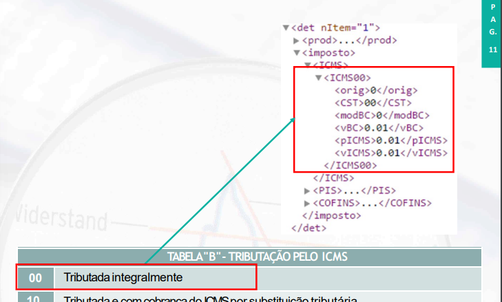
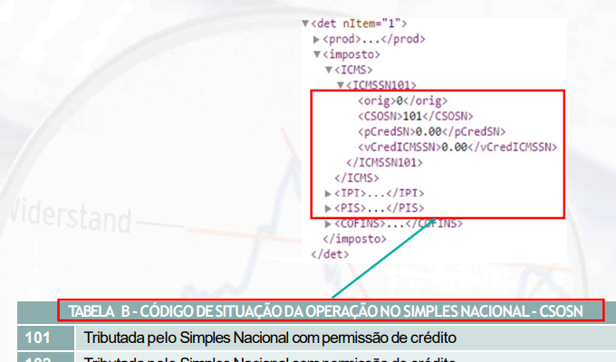
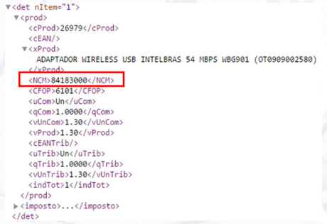

  <h1>Tributação para Programadores</h1>

Casa do Desenvolvedor | Tributacao para Programadores

> Tudo o que um programador de software precisa entender sobre tributação fiscal e documentos fiscais eletrônicos.

---

# Módulo 2 - Códigos Fiscais

> [PDF Módulo 2](assets/Modulo2.pdf)

## 📌 Table of Contents

- [Aula 01. CFOP](#aula-01-cfop)
  - [Primeiro Dígito](#primeiro-dígito)
  - [Segundo Dígito](#segundo-dígito)
  - [Terceiro e Quarto Dígito](#terceiro-e-quarto-dígito)
  - [Observações](#observações)
  - [Exemplos](#exemplos)
- [Aula 02. CRT](#aula-02-crt)
  - [Onde é informado o CRT? Qual campo?](#onde-é-informado-o-crt-qual-campo)
  - [Exemplo](#exemplo)
- [Aula 03. CST Tabela A](#aula-03-cst-tabela-a)
  - [Tabela A | Origem da Mercadoria](#tabela-a--origem-da-mercadoria)
  - [Exemplo](#exemplo-1)
- [Aula 04. CST Tabela B](#aula-04-cst-tabela-b)
  - [Tabela B | Tributação pelo ICMS](#tabela-b--tributação-pelo-icms)
  - [Exemplo](#exemplo-2)
- [Aula 05. CSOSN Tabela B](#aula-05-csosn-tabela-b)
  - [Tabela B | Código de Situação da Operação no Simples Nacional - CSOSN](#tabela-b--código-de-situação-da-operação-no-simples-nacional---csosn)
  - [Exemplo](#exemplo-3)
- [Aula 06. NCM](#aula-06-ncm)

---

Códigos fiscais de preenchimento dos documentos fiscais.

- `CFOP` | Código Fiscal da Operação e Prestação de Serviço
- `CRT` | Código de Regime Tributário
- `CST` | Código de Situação Tributária
- `CSOSN` | Código de Situação da Operação no Simples Nacional
- `NCM` | Nomenclatura Comum do Mercosul
- `CEST` | Código Especificador da Substituição Tributária

# Aula 01. CFOP

> Código Fiscal da Operação e Prestação de Serviços

O **Código de Operações e Prestações** das entradas e saídas de produtos, nas operações internas, interestaduais e exterior, é representado por um código numérico que identifica a natureza de circulação da mercadoria ou a prestação de serviço de transporte.

Esse código obrigatoriamente deve ser informado em todos os documentos fiscais, tais como a **NF-e**, **CT-e**, **NFC-e**, **escrituração de livros** e **SPED Fiscal**, o que torna um fator determinante a respeito da tributação nas operações fiscais.

## Primeiro Dígito

Primeiro dígito evidencia o produto ou a atividade de entrada ou saída, e se a operação é interna, interestadual ou destinada ao exterior.

Para NF-e de Entrada:

- `1000` | Entradas ou Prestações de Serviços para o Estado
- `2000` | Entradas ou Prestações de Serviços para outros Estados
- `3000` | Entradas ou Prestações de Serviços para o Exterior

Para NF-e de Saída:

- `5000` | Saídas ou Prestações de Serviços para o Estado
- `6000` | Saídas ou Prestações de Serviços para outros Estados
- `7000` | Saídas ou Prestações de Serviços para o Exterior

| Local Destinatário | Entrada | Saída |
|:------------------:|:-------:|:-----:|
|  Dentro do Estado  |   `1`   |  `5`  |
|   Fora do Estado   |   `2`   |  `6`  |
| Comércio Exterior  |   `3`   |  `7`  |

## Segundo Dígito

Segundo dígito evidencia qual é o grupo ou a operação referida no documento fiscal (qual o grupo que se enquadra).

## Terceiro e Quarto Dígito

Terceiro e quarto dígitos especificam o tipo de operação e/ou prestação.

## Observações

Num mesmo documento fiscal é possível ter mais de um CFOP, desde que sejam de **mesma natureza** (primeiro número).

A descrição da operação deve estar de acordo com o CFOP informado no item da nota.

O CFOP colocado na operação (<CFOP>) deve ser o mesmo da natureza da operação (<natOp>).
Se é dado como saída (venda), toda operação, todos os itens devem ser tratados como saída (venda).

## Exemplos

(<a href="#top-readme">back to top</a>)

# Aula 02. CRT

> Código de Regime Tributário
 
Define a tributação de cada estabelecimento que está emitindo o documento fiscal eletrônico.

Estabelecimentos poderão ser:
- Simples Nacional
- Lucro Presumido
- Lucro Real

Se a empresa é contribuinte do Simples Nacional:
- **1** | Simples Nacional - Será preenchido pelo contribuinte quando for optante pelo Simples Nacional
- **2** | Simples Naciona - Excesso sublimite de receita bruta, será preenchido pelo contribuinte optante pelo Simples nacional que tiver ultrapassado o sublimite de receita bruta fixado pelo estado/DF e estiver impedido de recolher ICMS/ISS por esse regime (conforme art. 19 e 20 da Lei Complementar 123/06)
- **3** | Regime Normal - Será preenchido pelo contribuinte que não estiver na situação 1 ou 2.

## Onde é informado o CRT? Qual campo?

Campo **<CRT>**, colocando a classificação da empresa que está emitindo o documento fiscal (1, 2 ou 3).

- CRT `1` | Deve utilizar situação tributária informando CSOSN
- CRT `2`, CRT `3`  | Deve utilizar situação tributária informando CST

## Exemplo

(<a href="#top-readme">back to top</a>)

# Aula 03. CST Tabela A

> Código de Situação Tributária

Composto por dois números, mas recebe obrigatóriamente um número inicial.

- Primeiro Número | Origem da mercadoria ([Tabela A](#tabela-a-origem-da-mercadoria))
- Segundo e Terceiro Número | Tributação do ICSM

Tag **<orig>**

## Tabela A | Origem da Mercadoria

| Código | Descrição                                                                                                             |
|:------:|:----------------------------------------------------------------------------------------------------------------------|
|  `0`   | Nacional, exceto as indicadas nos códigos 3, 4, 5 e 8                                                                 |
|  `1`   | Estrangeira - Importação Direta, exceto a indicada no código 6                                                        |
|  `2`   | Estrangeira - Adquirida no Mercado Interno, exceto a indicada no código 7                                             |
|  `3`   | Nacional, Mercadoria ou Bem com Conteúdo de Importação superior a 40% e infoerior ou igual a 70%                      |
|  `4`   | Nacional, cuja produção tenha sido feita em conformidade com os processos produtivos de acordo com o Decr. Lei 288/67 |
|  `5`   | Nacional, Mercadoria ou Bem com Conteúdo de Importação Inferior ou Igual a 40%                                        |
|  `6`   | Estrangeira - Importação Direta, sem similar nacional, constante em lista de Resolução CAMEX e gás natural            |
|  `7`   | Estrangeira - Adquirida no Mercado Interno, sem similar nacional, constante em lista de Resolução CAMEX e gás natural |
|  `8`   | Nacional, Mercadoria ou BEm com Conteúdo de Importação Superior a 70%                                                 |

## Exemplo

(<a href="#top-readme">back to top</a>)

# Aula 04. CST Tabela B

> Código de Situação Tributária

CSOSN é utilizado pelas empresas optantes do Simples Nacional (CRT 1)

Origem do CST e CSOSN é o mesmo ([Tabela A](#tabela-a-origem-da-mercadoria))

## Tabela B | Tributação pelo ICMS

- `00` | Tributada integralmente
  - Tributação vai se dar totalmente sobre o item (sem redução ou isenção)
- `10` | Tributada e com cobrança do ICMS por substituição tributária
  - Esse item da nota fiscal tem uma substituição tributária, ou seja, imposto vai ser retido e recolhido anteriormente, e então repassado para o estado destino.
- `20` | Com redução de base de cálculo
  - Estado concedeu esse benefício fiscal para esse item da nota fiscal. Deve colocar o percentual de redução definido pelo estado na nota fiscal.
- `30` | Isenta ou não tributada e com cobrança do ICMS por substituição tributária
  - Não tem tributação pelo ICMS próprio, mas tem cobrança da substituição tributária.
- `40` | Isenta
  - Totalmente isenta. Não tem tributação.
  - Deve informar o motivo da isenção nas **informações adicionais** (amparo legal que deixa fazer).
- `41` | Não tributada
  - Ocorre o mesmo que a isenção, mas não tem motivo legal para isenção.
- `50` | Suspensão
  - Ocorre quando a mercadoria é suspensa de tributação, mas não é isenta.
- `51` | Diferimento
  - Imposto não deixa de ser recolhido, ele é diferido para o momento seguinte.
  - Naquela etapa não vai haver o destaque.
  - Deve informar o amparo legal nas **informações adicionais**
  - Geralmente ocorrem no próprio estado
- `60` | ICMS cobrado anteriormente por substituição tributária
  - Ocorre quando adquire a mercadoria diretamente da indústria (ou de um distribuidor) cujo imposto foi retido anteriormente por substituição tributária.
  - Não tem a retenção do imposto, mas já foi recolhido anteriormente pelo fornecedor.
  - Algumas UF exige que o contribuinte coloque o valor, base de cálculo e alíquota do imposto que foi retido anteriormente.
    - Em geral, informações de produtos que vem com o CST 10
- `70` | Com redução de base de cálculo e cobrança do ICMS por substituição tributária
  - Ocorre quando o estado concede redução de base de cálculo e tem a substituição tributária.
  - Deve informar o benefício concedido pelo Estado no campo de informações adicionais.
- `90` | Outros
  - Qualquer outra situação que não se enquadra nas anteriores.

## Exemplo

Tag **<CST>** ou **<CSOSN>** vêm logo após a tag **<orig>**

(<a href="#top-readme">back to top</a>)

# Aula 05. CSOSN Tabela B

> Código de Situação da Operação no Simples Nacional

Aplica somente as empresas optantes do Simples Nacional.

Esse código vem do preenchimento do CRT exclusivamente quando for igual a 1 (**<CRT>1</CRT>**)
- Neste caso, todos os itens devem seguir a [tabela B]() de CSOSN

## Tabela B | Código de Situação da Operação no Simples Nacional - CSOSN

- `101` | Tributada pelo Simples Nacional com permissão de crédito
  - Transferindo o crédito do ICMS para o destinatário/adquirente. Destinatário/adquirente vai ter direito a esse crédito do imposto.
  - Pra utilizar esse código, precisa:
    - Mercadoria deve ser vendida para uma empresa **não** seja optante do Simples Nacional
    - Mercadoria deve ser destinada a comercialização ou industrialização
  - O percentual do valor que pode ser transferido vem do escritório de contabilidade do emitente da nota fiscal.
- `102` | Tributada pelo Simples Nacional sem permissão de crédito
    - Não pode transferir o crédito do ICMS para o destinatário/adquirente.
- `103` | Isenção do ICMS no Simples Nacional para faixa de receita bruta
  - Isenção do ICMS para empresas que estão dentro de uma faixa de receita bruta.
- `201` | Tributada pelo Simples Nacional com permissão de crédito e com cobrança do ICMS por substituição tributária
  - Permite o crédito, porém a operação tem a incidência do icms de substituição tributária.
- `202` | Tributada pelo Simples Nacional sem permissão de crédito e com cobrança do ICMS por substituição tributária
  - Não permite o crédito, mas tem a incidência do icms de substituição tributária.
- `203` | Isenção do ICMS no Simples Nacional para faixa de receita bruta e com cobrança do ICMS por substituição tributária
  - Isenção do ICMS para empresas que estão dentro de uma faixa de receita bruta e tem a incidência do icms de substituição tributária.
- `300` | Imune
  - Exportação de mercadorias
  - Empresa do Simples Nacional promovendo uma venda para o mercado externo.
- `400` | Não tributada pelo Simples Nacional
  - Não há incidência do imposto naquele momento
- `500` | ICMS cobrado anteriormente por substituição tributária (substituído) ou por antecipação
  - Similar ao **CST 60**
    - Ocorre quando adquire a mercadoria diretamente da indústria (ou de um distribuidor) cujo imposto foi retido anteriormente por substituição tributária.
- `900` | Outros
  - Qualquer outra situação que não se enquadra nas anteriores.

## Exemplo

(<a href="#top-readme">back to top</a>)

# Aula 06. NCM | CEST

## NCM

> Nomenclatura Comum do Mercosul

Contendo **8 dígitos**, é utilizado em todo Mercosul para identificar os produtos dos mais variados gêneros, criando assim uma classificação padrão para comprars e vendas e determinando as alíquotas aplicáveis dos tributos sobre esse produto. A lista completa pode ser analisada através do Download da Tabela do NCM do site da Receita Federal.

Determina toda tributação em relação ao IPI e toda codificação daquele produto.

Se não informado, Nota Fiscal é rejeitada. Se informado errado, gerará problemas pois trabalha atrelado ao CEST.

Vai ter o código definido com base na TIPI (Tabela do IPI)

Há a tag **<NCM>** em cada item para informar o NCM

### Exemplo

| NCM        | Descrição                         | TEC(%) |
|:-----------|:----------------------------------|:------:|
| 0101       | Cavalos, asininos e muares, vivos |        |
| 0101.2     | Cavalos                           |        |
| 0101.21.00 | Reprodutores de raça pura         |   0    |
| 0101.29.00 | Outros                            |   2    |
| 0101.30.00 | Asininos                          |   4    |
| 0101.90.00 | Muares                            |   4    |

## CEST

> Código Especificador da Substituição Tributária

Compartilhar uma forma geral de definição de produtos que têm substituição tributária.

Trabalha paralelamente ao NCM.

(<a href="#top-readme">back to top</a>)

